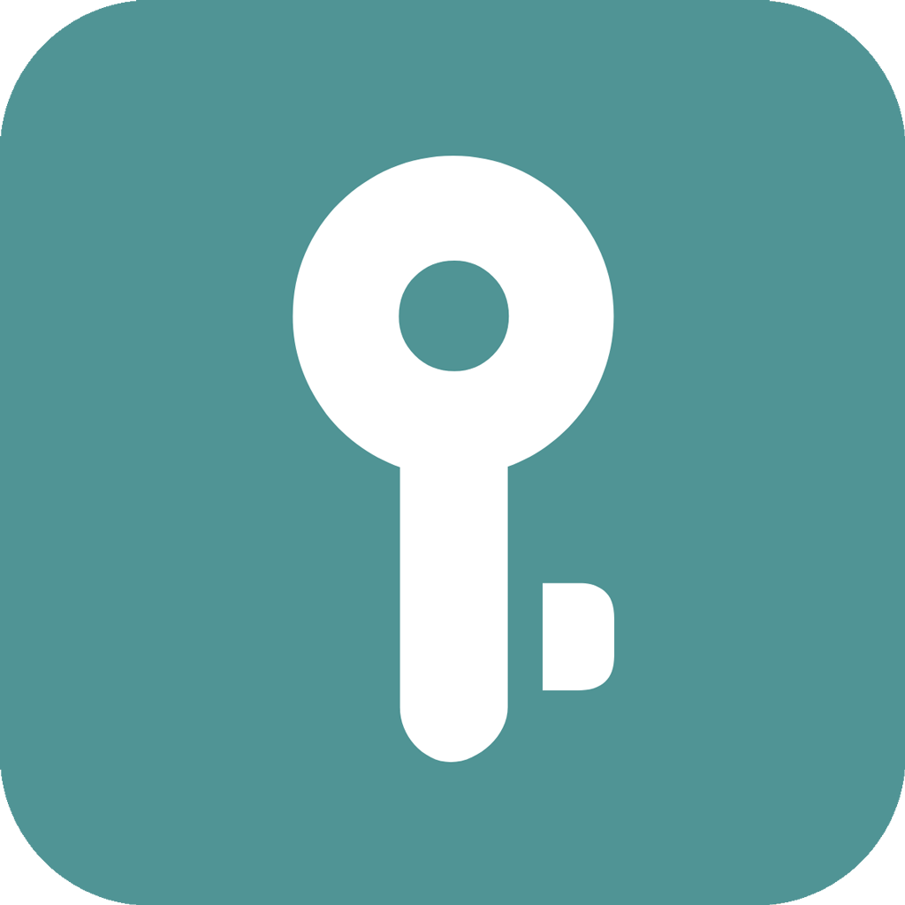

<div align="center">



# Nowser

A secure nostr key management and signing app for iOS and Android that supports multiple authentication methods:

- **NIP-07**: Acts as a browser extension replacement for mobile, allowing you to securely sign into nostr web apps
- **NIP-46**: Functions as a remote signer (like a "bunker"), letting you keep your private keys on your phone while signing requests from your desktop
- **NIP-55**: Supports Android's native key management system for secure key storage (similar to Apple Keychain)

This app helps you manage your nostr identity securely across devices while maintaining control of your private keys. It's designed to be a mobile-first solution for the growing nostr ecosystem.

</div>

## Platforms

| Platforms | NIP-07 | NIP-46 | NIP-55 |
| :----: | :----: | :----: | :----: |
| Android | √ | √ | √ |
| IOS | √ | √ | |
| MacOS | √ | √ | |

## Downloads

Android: Downlaod From [Release](https://github.com/haorendashu/nowser/releases) https://github.com/haorendashu/nowser/releases

IOS: Download from [TestFlight](https://testflight.apple.com/join/b4zVVxaM) https://testflight.apple.com/join/b4zVVxaM

MacOS: Download from [TestFlight](https://testflight.apple.com/join/9VD8rk5B) https://testflight.apple.com/join/9VD8rk5B

## Building from Source

### Prerequisites
- Flutter SDK
- Android Studio (for Android builds)
- Xcode (for iOS builds)
- Git

### Platform-Specific Notes

#### iOS/macOS Prerequisites
1. Install CocoaPods if you haven't already:
```bash
sudo gem install cocoapods
```

2. Install project CocoaPods:
```bash
cd ios  # or 'cd macos' for macOS builds
pod install
```

3. Open the workspace in Xcode:
```bash
open ios/Runner.xcworkspace  # or 'open macos/Runner.xcworkspace' for macOS
```

4. In Xcode:
   - Select the Runner project in the navigator
   - Select the Runner target
   - Under Signing & Capabilities:
     - Select your Team
     - Update Bundle Identifier if needed
   - If building for macOS, ensure the following capabilities are enabled:
     - Outgoing Connections (Client)
     - Incoming Connections (Server)

#### Web
```bash
flutter build web
```
- The web build will be available in `build/web` directory
- You can serve it using any web server
- For local testing, you can use Python's built-in server:
```bash
cd build/web
python -m http.server 8000
```

#### Desktop Builds
- For Windows, you need Visual Studio with "Desktop development with C++" workload
- For Linux, you need the following dependencies:
```bash
sudo apt-get install clang cmake ninja-build pkg-config libgtk-3-dev liblzma-dev
```

### Build Instructions

1. Clone the repository with submodules:
```bash
git clone --recursive https://github.com/haorendashu/nowser.git
cd nowser
```

2. If you already cloned without submodules, initialize and update them:
```bash
git submodule init
git submodule update
```

3. Install Flutter dependencies:
```bash
flutter pub get
```

4. Build the app:
- For Android:
```bash
flutter build apk
```
- For iOS:
```bash
flutter build ios
```

